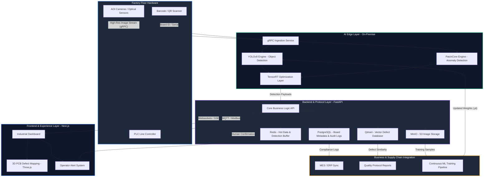

# DetectX-PCB Architecture

This document outlines the multi-layered, AI-native architecture designed for high-speed PCB defect detection.

## System Overview

## Layer Descriptions

### 1. Factory Floor Hardware
Integrates directly with the manufacturing line using high-resolution AOI (Automated Optical Inspection) cameras and PLC controllers for real-time board handling.

### 2. AI Edge Layer
Optimized for minimum latency. YOLOv8 handles rapid object detection while PatchCore identifies unsupervised anomalies. All models are optimized via TensorRT for edge performance.

### 3. Core Protocol Layer
The "brain" of the solution. Manages the business logic, metadata persistence, and large-scale vector similarity search for historical defect analysis.

### 4. Frontend & Experience
A premium, dark-mode dashboard providing operators with real-time alerts and 3D defect mapping for immediate action.

### 5. Enterprise Integration
Connects the shop floor to the top floor. Syncs quality data with MES/ERP systems and feeds a continuous learning pipeline for model improvement.
