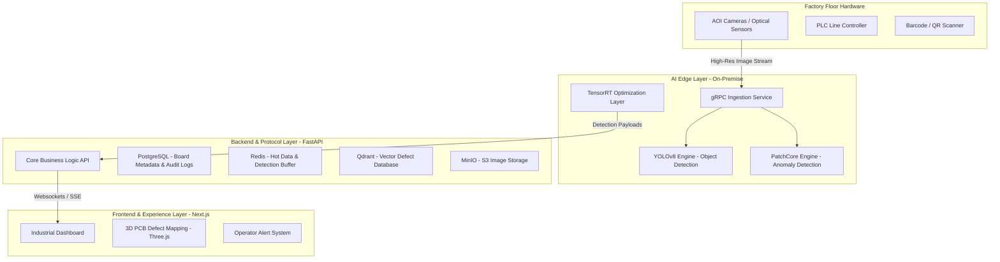

# 🛡️ DetectX-PCB

**DetectX-PCB** is a premium, AI-native defect detection system engineered for high-speed printed circuit board (PCB) manufacturing. By combining state-of-the-art computer vision (YOLOv8) with a high-performance, minimalist dashboard, it provides real-time identification of manufacturing defects with millisecond latency.

---

## 🚀 Quick Start

### Prerequisites
- **Node.js**: v18.0 or higher
- **Python**: v3.9 or higher
- **Package Managers**: npm and pip

### 1. Backend Setup
Navigate to the `backend` directory and install dependencies:
```bash
cd backend
pip install -r requirements.txt
```
Start the FastAPI server:
```bash
python -m uvicorn main:app --reload --port 8000
```
*The backend will be available at `http://localhost:8000`.*

### 2. Frontend Setup
Navigate to the `frontend` directory and install dependencies:
```bash
cd frontend
npm install
```
Start the Next.js development server:
```bash
npm run dev -- -p 3001 --webpack
```
*The dashboard will be available at `http://localhost:3001`.*

---

## 🏗️ Solution Architecture

DetectX-PCB utilizes a multi-layered architecture designed for high-throughput manufacturing environments.



---

## 🛠️ Technology Stack

- **Frontend**: Next.js 14+, TypeScript, Tailwind CSS, Recharts, Three.js
- **Backend**: FastAPI (Python), SQLModel (SQLite/PostgreSQL)
- **AI/ML**: YOLOv8 (Ultralytics), OpenCV
- **Design**: Premium Dark Mode, Minimalist UI/UX

---

## 📂 Project Structure

- `/frontend`: Next.js dashboard and analytics interface.
- `/backend`: FastAPI service, database models, and API endpoints.
- `/ai`: Core inference logic and model handling.
- `/assets`: Project documentation and architecture diagrams.

---

## ⚠️ Troubleshooting

- **Frontend Port**: The dashboard is configured to run on port `3001`. If port `3000` is used, ensure the backend CORS settings are updated.
- **Turbopack Issues**: If you encounter native binding errors on Windows, run the frontend with the `--webpack` flag as shown in the startup instructions.
- **Mock Inference**: If a physical camera or specialized hardware is not detected, the system automatically falls back to a simulated inference engine for testing.

---

## 📄 License
This project is part of the DetectX-PCB industrial suite. All rights reserved.
